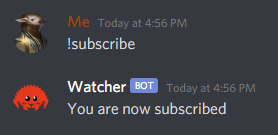
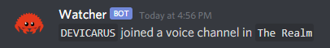

# Welcome to watcher 👀

> A Discord bot that notifies subscribers when someone joins a voice channel

  

⬇️

  

## Usage
Set up environment variables `DISCORD_TOKEN` and `PREFIX` (`.env` supported) and do `cargo run`.

Bring up help by using the `help` command.\
Subscribe by `subscribe` and unsubscribe by `unsubscribe`.

Subscriptions are server-wide.

 

> ⚠️ WARNING: Checking out the source code may be dangerous for people who actually know how to use Rust.